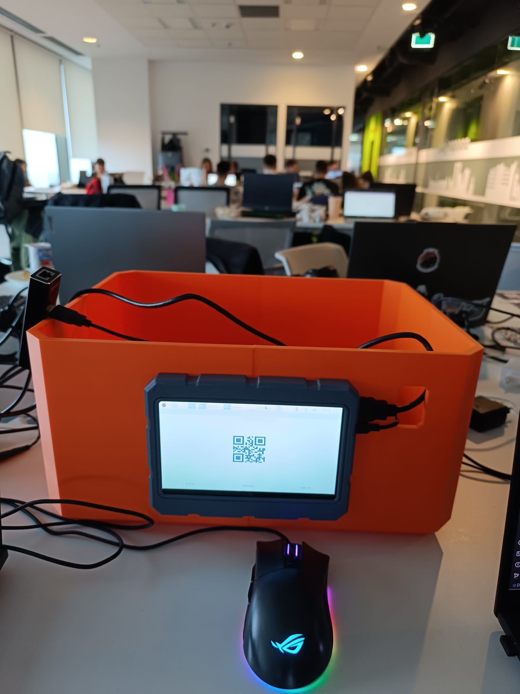
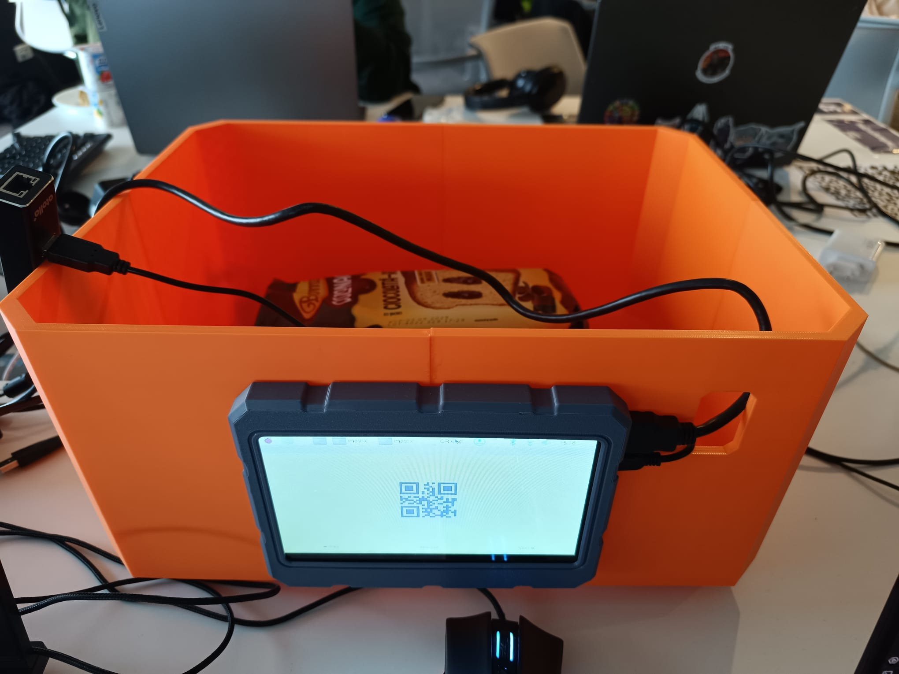

# API developed for DropX


## 🚀 Overview
This part of the project is a FastAPI application integrated with Firebase. It provides an API for retrieving the data stored in Firebase and serving it via HTTP endpoints which is used all around our ecosystem.

## 🛠 Installation

### 1️⃣ Clone the Repository
```bash
git clone https://github.com/StefanBirsan/DropixPiApi.git
cd DropixPiApi
```

### 2️⃣ Create a Virtual Environment (Optional but Recommended)
```bash
python -m venv venv
source venv/bin/activate  # On Windows use `venv\Scripts\activate`
```


### 4️⃣ Set Up Firebase
- Configure Firebase Realtime Database and get your credentials.
- Ensure that you make setup the config file properly 

### 5️⃣ Run the Application
```bash
uvicorn main:app --host 0.0.0.0 --port 8000 --reload
```

## 🖼️ Final Prototype using the BOX
<div style="display: flex; justify-content: center; gap: 20px;">
    
    
</div>


